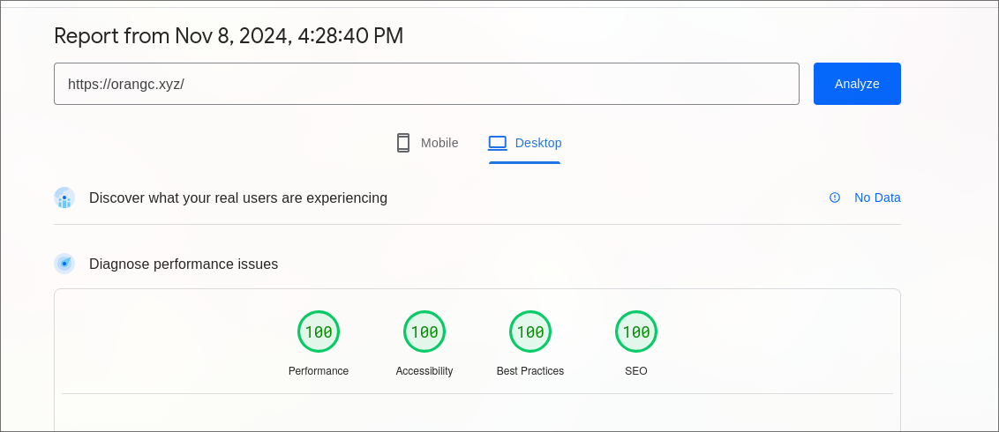

+++
title = 'this website'
date = 2024-11-08T13:20:57Z
draft = false
+++

The blog website itself is built with [Tailwind CSS](https://tailwindcss.com/) and [Hugo](https://gohugo.io/), originally based off the [Archie](https://github.com/athul/archie) theme. The code is not open source, unlike most of my other projects, because people tend to take my website code without following the license. The main website is built with Tailwind alone, and has zero Javascript!

Before this third (or fourth?) version of my site, I had never used Tailwind before; and that is something that I really regret. Tailwind is amazing and I don't think I ever want to work without it again.

Fun fact: this page has a perfect Lighthouse score!
